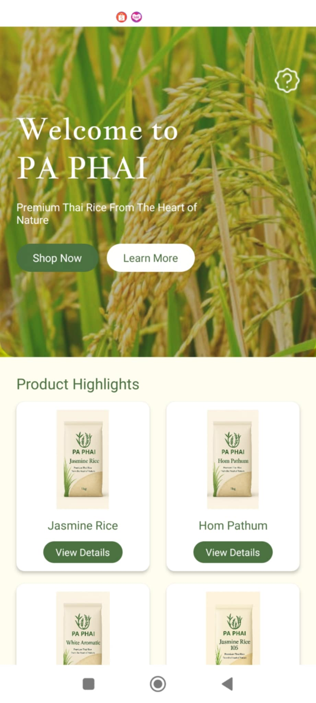
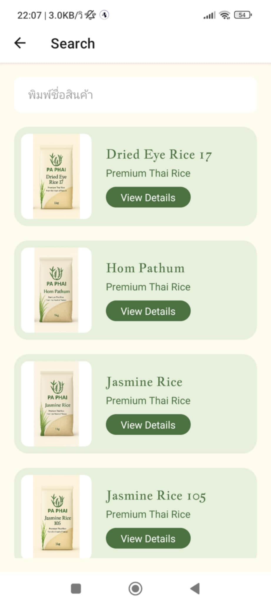
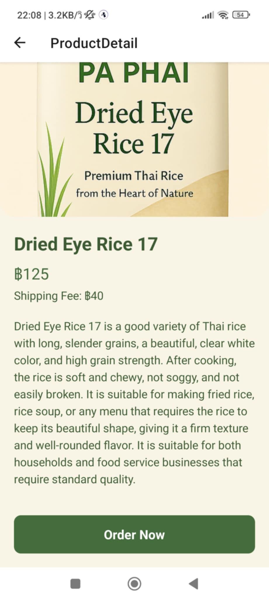
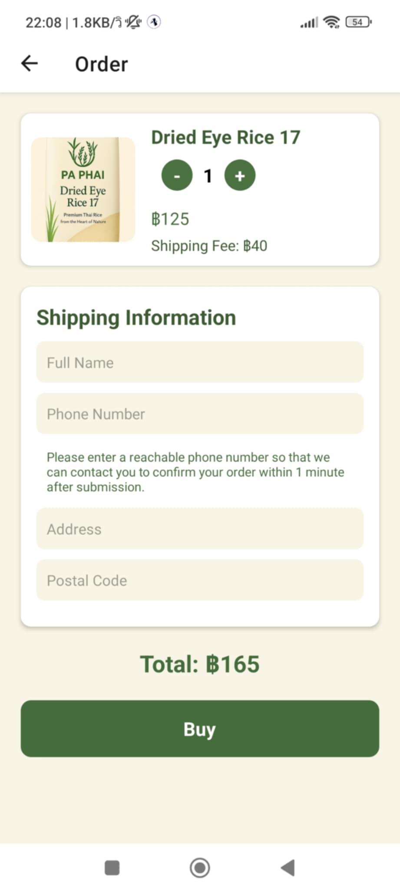
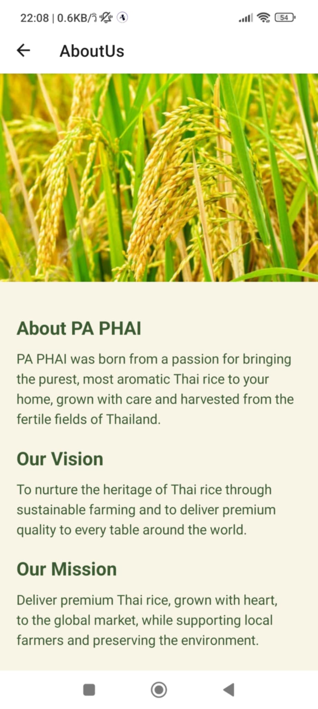
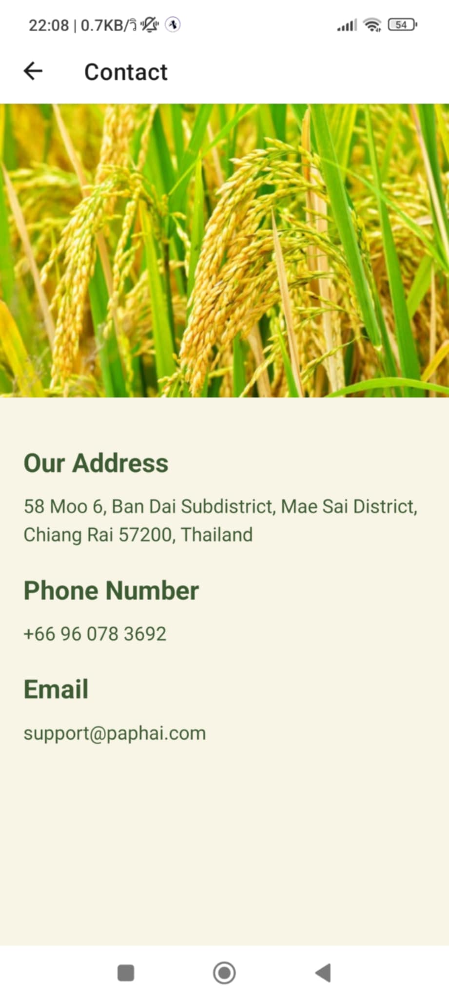

ชื่อ - นามสกุล (Full Name):Wasan Nachai
รหัสนักศึกษา (Student ID):6631503038
ชื่อแอป (App Name):Pa-PHAI
Framework ที่ใช้ (Framework Used): React Native
ลิงก์ GitHub Repository: [https://github.com/WasanNachai/PaPhaiApplication]
ลิงก์ไฟล์ติดตั้ง (APK/IPA): [https://expo.dev/accounts/6631503038/projects/paphaiapp/builds/9b5d88ea-5d94-4a8c-ad38-0afdb0b6eab7]

1. การออกแบบแอป | App Concept and Design (2 คะแนน / 2 pts)
1.1 ผู้ใช้งานเป้าหมาย | User Personas
ตัวอย่าง (Example):

Persona 1
ชื่อ: ธนา สุขใจ

อายุ: 35 ปี

อาชีพ: เจ้าของร้านอาหารไทย

ความต้องการ: ต้องการข้าวหอมคุณภาพสูงสำหรับทำอาหารในร้าน

Persona 2
ชื่อ: พลอย วัฒนานันท์

อายุ: 24 ปี

อาชีพ: ฟรีแลนซ์ออกแบบกราฟิก

ความต้องการ: ซื้อข้าวปลอดสารพิษออนไลน์เพื่อรับประทานในครอบครัว

Persona 3
ชื่อ: ลุงสมบัติ ภูมิใจไร่

อายุ: 58 ปี

อาชีพ: เกษตรกร

ความต้องการ: หาข้าวคุณภาพดีเพื่อเก็บไว้เพาะปลูกหรือขายในท้องถิ่น

Persona 4
ชื่อ: นางสาวไอรดา ทองคำ

อายุ: 28 ปี

อาชีพ: เจ้าของคาเฟ่ข้าวหอม

ความต้องการ: อยากซื้อข้าวชนิดพิเศษ เช่น Jasmine 105 เพื่อใช้ในเมนูขนมและเครื่องดื่มคาเฟ่

Persona 5
ชื่อ: ศรันย์ ชูใจ

อายุ: 32 ปี

อาชีพ: พนักงานบริษัทเอกชน

ความต้องการ: ต้องการซื้อข้าวแพ็กเล็กออนไลน์ ส่งตรงถึงบ้าน เพื่อประหยัดเวลาในการซื้อของ

Persona 6
ชื่อ: มิ้นท์ ศศิธร

อายุ: 21 ปี

อาชีพ: นักศึกษา

ความต้องการ: อยากหาข้าวออร์แกนิคกินเองในหอพัก พร้อมบริการจัดส่งฟรีหรือค่าส่งถูก

Persona 7
ชื่อ: ภาสกร วิริยะ

อายุ: 45 ปี

อาชีพ: ผู้บริหารโรงแรม

ความต้องการ: มองหาผู้จัดส่งข้าวคุณภาพสูงสำหรับลูกค้าของโรงแรมแบบ bulk order

Persona 8
ชื่อ: คุณนิด สุนันทา

อายุ: 40 ปี

อาชีพ: คุณแม่บ้าน

ความต้องการ: อยากได้ข้าวปลอดภัยสำหรับเด็กและผู้สูงอายุในครอบครัว

Persona 9
ชื่อ: เจนนี่ อภิสรา

อายุ: 27 ปี

อาชีพ: Content Creator ด้านสุขภาพ

ความต้องการ: อยากรีวิวข้าวปลอดสารพิษให้แฟนคลับ พร้อมสั่งซื้อง่ายในแอป

Persona 10
ชื่อ: วรัญญา ภักดี

อายุ: 50 ปี

อาชีพ: เจ้าของร้านขายของฝาก

ความต้องการ: ต้องการซื้อข้าวแบบแพ็กเกจสวย ๆ เพื่อขายเป็นของฝากในร้านตัวเอง

1.2 เป้าหมายของแอป | App Goals
ตัวอย่าง (Example):

- ช่วยเพิ่มช่องทางการเลือกซื้อข้าวที่มีคุณภาพ
- เพิ่มความสะดวกในการซื้อข้าว ไม่จำเป็นต้องไปที่หน้าร้าน
- มีข้าวให้เลือกซื้อที่หลากหลาย
1.3 โครงร่างหน้าจอ / Mockup

1.หน้า Home
แสดงแบนเนอร์ "Welcome to PA PHAI" บนรูปพื้นหลังนาข้าว

มีปุ่มให้กด 2 ปุ่ม:

Shop Now ➔ ไปหน้า Search

Learn More ➔ ไปหน้า About Us

Section: Product Highlights

แสดงสินค้าข้าวแนะนำ 4 แบบ

แต่ละสินค้า มีชื่อสินค้า รูป และปุ่ม View Details

Section: About Us

บรรยายความเป็นมาของแบรนด์

แสดงโลโก้แบรนด์ด้านล่าง

2.หน้า Search
ช่อง Search Bar (พิมพ์ชื่อสินค้าเพื่อค้นหา)

แสดงรายการสินค้าเรียงลงมา

แต่ละสินค้าแสดง: รูป, ชื่อ, และ View Details

กด View Details ของแต่ละชิ้น ➔ ไปหน้า Product Detail

3.หน้า Product Detail
แสดง:

รูปสินค้าใหญ่

ชื่อสินค้า

ราคา (Price)

ค่าจัดส่ง (Shipping Fee)

รายละเอียดสินค้า (Details)

ปุ่ม Order Now

กดแล้วพาไปหน้า Order พร้อมส่งข้อมูลสินค้าไปด้วย

4.หน้า Order
แสดงรูปสินค้า + ข้อมูลสรุปสินค้า

มีปุ่มเพิ่ม/ลดจำนวนสินค้า

ฟอร์มกรอกข้อมูล:

Full Name

Phone Number

Address

Postal Code

ข้อความแนะนำใต้เบอร์โทร:

"Please enter a reachable phone number so that we can contact you to confirm your order within 1 minute after submission."

ระบบคิดราคา:

ถ้าซื้อ 5-10 ชิ้น ➔ ลด 5%

ถ้าซื้อมากกว่า 10 ชิ้น ➔ ลด 10%

ปุ่ม Buy

กดแล้วบันทึกข้อมูลการสั่งซื้อลง Firebase

1.4 การไหลของผู้ใช้งาน | User Flow
ตัวอย่าง (Example):

เปิดแอป → หน้า Home → (กด Shop Now → หน้า Search → เลือกสินค้า → หน้า Product Detail → กด Order Now → หน้า Order → กรอกข้อมูล → Buy) หรือ (กด Learn More → หน้า About Us)

2. การพัฒนาแอป | App Implementation (4 คะแนน / 4 pts)
2.1 รายละเอียดการพัฒนา | Development Details
เครื่องมือที่ใช้ / Tools used:

- React-native 0.76.9
- Firebase v10.9.0
- Expo 52.0.46
2.2 ฟังก์ชันที่พัฒนา | Features Implemented
Checklist:
- [x] สั่งสินค้า
- [x] ค้นหาสินค้า
- [x] ซิงก์กับ Firebase
2.3 ภาพหน้าจอแอป | App Screenshots
แนบภาพหรือ URL (Attach images or image links):

- 
- 
- 
- 
- 
- 

3. การ Build และติดตั้งแอป | Deployment (2 คะแนน / 2 pts)
3.1 ประเภท Build | Build Type
[x] Debug
[ ] Release
3.2 แพลตฟอร์มที่ทดสอบ | Platform Tested
[x] Android
[ ] iOS
3.3 ไฟล์ README และวิธีติดตั้ง | README & Install Guide
แนบไฟล์หรือคำอธิบายการติดตั้งแอป | Insert steps

1. ดาวน์โหลดไฟล์ .apk
2. เปิดในอุปกรณ์ Android
3. ติดตั้งผ่าน File Manager
4. การสะท้อนผลลัพธ์ | Reflection (2 คะแนน / 2 pts)

เรียนรู้การใช้ Firebase Firestore เพื่อบันทึกข้อมูลการสั่งซื้อแบบ Real-time รวมถึงการใช้งาน Firebase Storage สำหรับเก็บไฟล์รูปภาพสินค้า

พบปัญหาเรื่องการโหลด Asset (ฟอนต์, รูปภาพ) ที่ทำให้หน้า Home ไม่แสดงผลหลังจาก navigate กลับมา จึงได้เรียนรู้การใช้ useFonts และ AppLoading เพื่อจัดการ Asset Lifecycle ให้ถูกต้อง

ได้เรียนรู้การทำ Build APK ผ่าน Expo EAS Build และเข้าใจขั้นตอนตั้งค่า Android Package Name, Signing Key รวมถึงข้อแตกต่างระหว่าง Debug กับ Release Build

หากมีเวลาเพิ่มเติม อยากพัฒนา Feature:

ระบบ Login/Register โดยเชื่อมกับ Firebase Authentication

เพิ่มระบบจัดการ Inventory จริงๆ เช่น อัปเดตจำนวนสินค้าหลังจากการสั่งซื้อ

ทำระบบ Sync แบบ Real-time Orders Dashboard สำหรับ Admin เพื่อดูยอดขายผ่าน Firebase

พัฒนาให้รองรับการแจ้งเตือน (Push Notification) เมื่อมีการสั่งซื้อใหม่

5. การใช้ AI ช่วยพัฒนา | AI Assisted Development (Bonus / ใช้ประกอบการพิจารณา)
5.1 ใช้ AI ช่วยคิดไอเดีย | Idea Generation
Prompt ที่ใช้:

"Suggest mobile app ideas for selling Thai rice products with online ordering."

ผลลัพธ์:

ได้ไอเดียแอป "ขายข้าวไทยออนไลน์" ที่มีระบบค้นหาสินค้า สั่งซื้อ และจัดการออเดอร์แบบ Real-time

5.2 ใช้ AI ช่วยออกแบบ UI | UI Layout Prompt
Prompt ที่ใช้:

"Design a simple home screen and search page layout for a mobile rice shop app using React Native."

ผลลัพธ์:

ได้โครงสร้างหน้าจอ HomeScreen + SearchScreen พร้อม Section แสดงสินค้า, ปุ่ม Shop Now และ About Us

5.3 ใช้ AI ช่วยเขียนโค้ด | Code Writing Prompt
Prompt ที่ใช้:

"How to display a list of products from Firebase Firestore in React Native?"

ผลลัพธ์:

ได้ตัวอย่างโค้ด useEffect + getDocs มาดึงข้อมูลสินค้าและ map ออกมาแสดงในหน้า SearchScreen

5.4 ใช้ AI ช่วย debug | Debug Prompt
Prompt ที่ใช้:

"React Native: HomeScreen shows blank after navigating back. Possible causes?"

ผลลัพธ์:

AI วิเคราะห์ว่าต้องเช็ก Asset Loading และ Font Loading ก่อน render

แนะนำใช้ useFonts() และ AppLoading เพื่อแก้ปัญหาได้สำเร็จ

5.5 ใช้ AI ช่วย Deploy | Deployment Prompt
Prompt ที่ใช้:

"How to build React Native app as APK using EAS Build in Expo?"

ผลลัพธ์:

ได้ขั้นตอนการใช้ eas build -p android

เข้าใจวิธีเซ็ต Android Package Name, Signing Key และการติดตั้ง APK บนมือถือ Android จริง

✅ Checklist ก่อนส่ง | Final Checklist
[x] กรอกข้อมูลครบทุก Section
[x] แนบ GitHub และไฟล์ติดตั้ง
[x] สะท้อนผล และใช้ AI อย่างมีเหตุผล